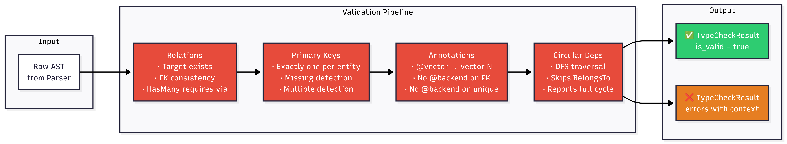

docs/en/architecture.md

# chameleonDB Architecture

## System Overview

## 2. Compilation & Validation Flow

## Type Checker Detail

## Backend Annotations Model

## Component Responsibilities

### Rust Core (`chameleon-core`)

**Parser** — Transforms `.cham` source into an AST using LALRPOP grammar. Handles all syntax including entities, fields, relations, type modifiers, default values, and backend annotations.

**Type Checker** — Validates the AST before it reaches the runtime. Organized in three focused modules: `relations.rs` checks all entity references and foreign key consistency, `constraints.rs` validates primary keys and annotation rules, and the main `mod.rs` orchestrates the pipeline and produces structured error reports.

**Code Generator** — Produces type-safe bindings for Rust and Go from validated schemas. (Coming soon.)

**Query Optimizer** — Rule-based optimization for query execution plans. Deterministic, no ML in v1.0.

### Go Runtime (`chameleon`)

**Engine** — Entry point for the Go side. Loads schemas via FFI, deserializes JSON into Go types, and exposes the public API. Custom JSON marshal/unmarshal handles extended types like `vector(N)` and arrays.

**Query Executor** — Translates validated queries into backend-specific operations. (Coming soon.)

**Connection Pool** — pgx-based PostgreSQL connection management. (Coming soon.)

**Backend Registry** — Routes queries to the correct backend based on field annotations. Manages fallback strategies. (Coming soon.)

### FFI Boundary

The FFI layer uses C ABI for maximum compatibility. Communication happens via JSON — schemas are serialized in Rust and deserialized in Go. Memory is explicitly managed: Rust allocates strings for return values, and the Go caller frees them via `chameleon_free_string`. Overhead is approximately 100ns per call.

## Design Decisions

### Why Rust for Core?
Rust provides true lambdas and closures (essential for the future query API), extreme type safety that catches errors at compile time, operator overloading for natural query syntax, and excellent performance on the parser and type-checker hot paths.

### Why Go for Runtime?
Go offers a simple concurrency model via goroutines (ideal for connection pooling), an excellent PostgreSQL driver (pgx), easy single-binary deployment, and great tooling for debugging.

### Why FFI instead of a single language?
Each language handles what it does best. The FFI overhead is minimal (~100ns). This approach is also future-proof: bindings for other languages (Node, Java, Python) can be added without changing the core.

### Why annotations are declarative (not routing)
Backend annotations are part of the schema definition, not the execution layer. This means schemas can be written and validated today, and routing strategies can evolve independently. When a new backend is added, no schema changes are needed — only the runtime routing logic changes.

### Why BelongsTo is excluded from circular dependency detection
`User → Order` (HasMany) and `Order → User` (BelongsTo) represent the same relationship from two sides. Treating both as directed edges would flag every bidirectional relationship as circular. Only ownership relationships (HasMany, HasOne) are traversed during cycle detection.

---

## Future Architecture (v2.0+)

## Performance Targets (v1.0)

| Operation | Target | Notes |
|-----------|--------|-------|
| Schema parse | < 10ms | One-time, cold start |
| Type check | < 5ms | Per schema validation |
| FFI call overhead | < 100ns | Per boundary crossing |
| Query compilation | < 1ms | Per query |
| Query execution | DB-bound | Optimized SQL generation |

## Current Status

| Component | Status | Notes |
|-----------|--------|-------|
| Parser | ✅ Complete | LALRPOP, all types and annotations |
| AST | ✅ Complete | Serializable, extensible |
| Type Checker | ✅ Complete | Relations, constraints, cycles |
| FFI Layer | ✅ Complete | Parse + validate via C ABI |
| Go Runtime | ✅ Basic | Engine + CLI functional |
| Query Builder | 🚧 Next | Filter, include, select |
| PostgreSQL Backend | ⏳ Upcoming | Connection pool + execution |
| Backend Registry | ⏳ Upcoming | Annotation-based routing |
| Migration Generator | ⏳ Upcoming | Schema → SQL diff |
| Code Generator | ⏳ Upcoming | Type-safe API bindings |