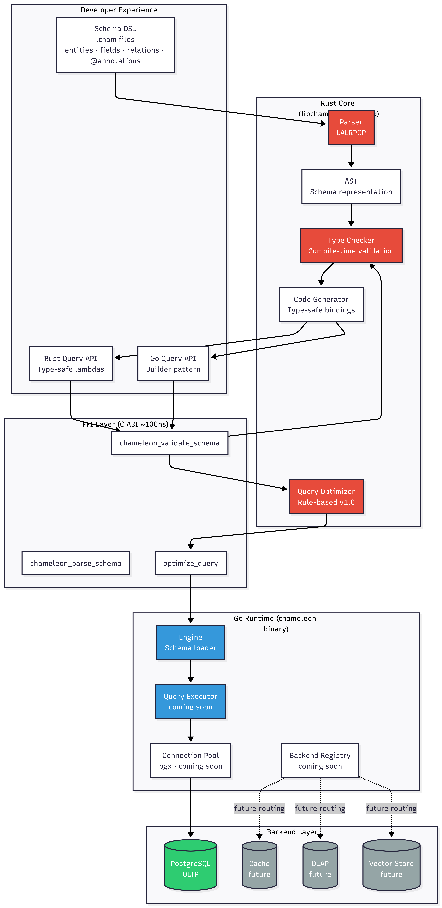
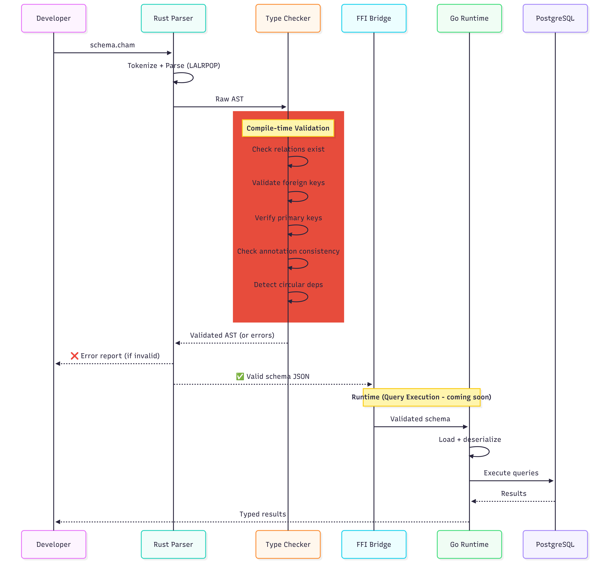

# Arquitectura de ChameleonDB


## Visión General del Sistema



ChameleonDB es una **plataforma de base de datos gobernada por schemas** con garantías de integridad explícitas. A diferencia de las bases de datos tradicionales que tratan la evolución del schema de manera informal, ChameleonDB gobierna los schemas en tiempo de ejecución mediante versionado, integridad criptográfica y modos operativos explícitos.

---

## Capas de la Arquitectura

```
┌───────────────────────────────────────────────┐
│  Capa de Aplicación                           │
│  - API de Query Builder                       │
│  - Mutaciones (Insert/Update/Delete)          │
│  - Modo Debug                                 │
└───────────────────────────────────────────────┘
                    ↓
┌───────────────────────────────────────────────┐
│  Capa de Seguridad                            │
│  - Modos de Integridad (readonly/standard/...)│
│  - Upgrades protegidos con contraseña         │
│  - Aplicación de modos                        │
└───────────────────────────────────────────────┘
                    ↓
┌───────────────────────────────────────────────┐
│  Schema Vault                                 │
│  - Schemas versionados (v001, v002, ...)      │
│  - Verificación de integridad SHA256          │
│  - Snapshots inmutables                       │
│  - Log de auditoría append-only               │
└───────────────────────────────────────────────┘
                    ↓
┌───────────────────────────────────────────────┐
│  Capa de Runtime                              │
│  - Query Executor                             │
│  - Connection Pool (pgx)                      │
│  - Mapeo de Errores                           │ 
│  - IdentityMap (deduplicación)                │
└───────────────────────────────────────────────┘
                    ↓
┌───────────────────────────────────────────────┐
│  Backend de Base de Datos                     │
│  - PostgreSQL (v1.0)                          │
│  - MySQL (planeado v1.2)                      │
│  - DuckDB (planeado v1.5)                     │
└───────────────────────────────────────────────┘
```

---

## Componentes Principales

### 1. Rust Core (`chameleon-core`)

**Parser**  
Transforma el fuente `.cham` en un AST usando gramática LALRPOP. Maneja entidades, campos, relaciones, modificadores de tipo, valores por defecto y anotaciones de backend.

**Type Checker**  
Valida el AST antes del runtime. Organizado en tres módulos:
- `relations.rs` - Referencias a entidades y consistencia de foreign keys
- `constraints.rs` - Primary keys y reglas de anotaciones
- `mod.rs` - Orquestación del pipeline y reporte de errores

**Query Optimizer** (Planeado v1.5)  
Optimización basada en reglas para planes de ejecución de queries. Determinístico, sin ML en v1.x.

**Estado:** ✅ Completo

---

### 2. Schema Vault

**Propósito:** Almacenamiento de schemas versionados e inmutables con garantías de integridad.

**Estructura:**
```
.chameleon/vault/
├── manifest.json       # Versión actual + historial
├── integrity.log       # Traza de auditoría append-only
├── versions/
│   ├── v001.json      # Snapshot de schema inmutable
│   └── v002.json
└── hashes/
    ├── v001.hash      # Verificación SHA256
    └── v002.hash
```

**Características:**
- ✅ Registro automático de versión en cada migración
- ✅ Verificación de hash SHA256 antes de cada operación
- ✅ Detección de manipulación (si el hash no coincide → abortar)
- ✅ Trazabilidad de linaje (versiones padre)
- ✅ Traza de auditoría completa (quién, qué, cuándo)

**Flujo de trabajo:**
```
1. Usuario modifica schema.cham
2. chameleon migrate detecta cambios
3. Calcula hash SHA256
4. Registra como v002 (padre: v001)
5. Guarda snapshot en vault/versions/v002.json
6. Guarda hash en vault/hashes/v002.hash
7. Actualiza manifest.json
8. Registra en integrity.log
9. Aplica migración a la base de datos
```

**Estado:** ✅ Completo (v1.0)

---

### 3. Modos de Integridad

**Propósito:** Control de acceso basado en anillos para la gobernanza del schema.

| Modo | Anillo | Caso de Uso | Cambios de Schema |
|------|--------|-------------|-------------------|
| **readonly** | R3 | Producción (por defecto) | ❌ Bloqueado |
| **standard** | R2 | Equipos de desarrollo | ✅ Controlado |
| **privileged** | R1 | DBAs | ✅ Directo (logueado) |
| **emergency** | R0 | Recuperación de incidentes | ✅ Sin controles (auditado) |

**Aplicación de Modos:**
- El código de la aplicación verifica el modo antes de las operaciones
- Los upgrades de modo requieren autenticación con contraseña
- Los downgrades no requieren contraseña
- Todos los cambios de modo se loguean

**Protección con Contraseña:**
```bash
# Establecer contraseña
chameleon config auth set-password

# Upgrade (requiere contraseña)
chameleon config set mode=standard
🔐 Ingresá contraseña: ****

# Downgrade (sin contraseña)
chameleon config set mode=readonly
```

**Estado:** ✅ Completo (v1.0)

---

### 4. Go Runtime (`chameleon`)

**Engine**  
Punto de entrada para aplicaciones Go. Carga schemas desde el vault, verifica integridad, aplica modos y expone la API pública.

**Cambio clave en v1.0:**
```go
// ❌ VIEJO (inseguro - bypassea el vault)
eng := engine.NewEngine()
eng.LoadSchemaFromFile("any.cham")

// ✅ NUEVO (seguro - aplicado por vault)
eng, err := engine.NewEngine()
// ↑ Carga SOLO desde .chameleon/state/schema.merged.cham
// ↑ Verifica integridad automáticamente
// ↑ Aplica restricciones de modo
```

**Query Executor**  
Traduce queries validadas a SQL específico del backend. Maneja proyección de campos (`.Select()`), eager loading (`.Include()`) y filtros.

**Connection Pool**  
Manejo de conexiones PostgreSQL basado en pgx con reconexión automática y health checks.

**IdentityMap** (NUEVO en v1.0)  
Deduplicación automática de objetos en memoria. Al consultar con `.Include()`, los objetos padre se deduplican para ahorrar memoria.

Ejemplo:
```go
// Usuario con 100 posts
result := db.Query("User").
    Include("posts").
    Execute(ctx)

// Sin IdentityMap: Usuario duplicado 100 veces (ineficiente)
// Con IdentityMap: Usuario aparece una sola vez (eficiente)
```

**Mapeo de Errores**  
Mapeo integral de errores de PostgreSQL a errores de ChameleonDB con mensajes claros y sugerencias.

**Estado:** ✅ Completo (v1.0)

---

### 5. Herramientas CLI

**Comandos:**

| Comando | Propósito | Estado |
|---------|-----------|--------|
| `init` | Inicializar proyecto + vault | ✅ v1.0 |
| `migrate` | Generar y aplicar migraciones | ✅ v1.0 |
| `validate` | Validar sintaxis del schema | ✅ v1.0 |
| `version` | Devuelve la versión actual del CLI | ✅ v1.0 |
| `verify` | Verificar integridad del vault | ✅ v1.0 |
| `status` | Mostrar estado del vault + modo | ✅ v1.0 |
| `journal` | Ver historial de versiones | ✅ v1.0 |
| `config` | Gestionar modos y configuración | ✅ v1.0 |
| `introspect` | Generación DB → Schema | ✅ v1.0 |
| `check` | Validación de sintáxis (Utilizado en extensión VS code) | ✅ v1.0 |
| `uninstall` | Desintala ChameleonDB del sistema | ✅ v1.0 |

**Estado:** ✅ Completo (v1.0)

---

### 6. Límite FFI

Comunicación entre Rust core y Go runtime a través de C ABI.

**Cómo funciona:**
- Schemas serializados a JSON en Rust
- Pasados a Go mediante strings de C
- Go deserializa y utiliza
- Memoria gestionada explícitamente (Rust asigna, Go libera)

**Overhead:** ~100ns por llamada (insignificante para operaciones de DB)

**Estado:** ✅ Completo

---

## Flujo de Compilación y Validación



```
Archivos .cham
    ↓
Parser (LALRPOP)
    ↓
AST
    ↓
Type Checker
  - Validación de relaciones
  - Validación de constraints
  - Detección de ciclos
    ↓
Schema Validado
    ↓
Serialización JSON
    ↓
Límite FFI (C ABI)
    ↓
Go Runtime
    ↓
Registro en Schema Vault
  - Calcular SHA256
  - Guardar snapshot
  - Actualizar manifest
    ↓
Generación de Migración
    ↓
Ejecución SQL (PostgreSQL)
```

---

## Modelo de Seguridad

Ver [SECURITY_sp.md](SECURITY_sp.md) para detalles completos.

**Capas:**
1. **Permisos del SO** - Control de acceso a archivos (0700)
2. **Integridad de Hash** - Detección de manipulación SHA256
3. **Modos de Integridad** - Control de acceso en runtime
4. **Aplicación del Vault** - Sin bypass del schema
5. **Traza de Auditoría** - Forense completa

---

## Decisiones de Diseño

### ¿Por qué Rust para el Core?

- Lambdas y closures reales (esencial para la API de queries)
- Seguridad de tipos extrema (detectar errores en tiempo de compilación)
- Sobrecarga de operadores (sintaxis de consulta natural)
- Rendimiento excelente en caminos calientes del parser

### ¿Por qué Go para el Runtime?

- Concurrencia simple (goroutines para connection pooling)
- Excelente driver de PostgreSQL (pgx)
- Despliegue en un solo binario
- Grandes herramientas de debugging

### ¿Por qué FFI?

- Cada lenguaje hace lo que mejor sabe hacer
- Overhead mínimo (~100ns)
- A prueba de futuro (fácil agregar bindings a Node, Python, Java)

### ¿Por qué Schema Vault?

- Trata los schemas como artefactos de primera clase
- Inmutabilidad previene desviación silenciosa
- Integridad criptográfica (SHA256)
- Traza de auditoría completa para cumplimiento

### ¿Por qué Modos de Integridad?

- Gobernanza explícita (no solo configuración)
- Aplicación en runtime (no opcional)
- Escalamiento protegido con contraseña
- Listo para cumplimiento out of the box

---

## Objetivos de Performance (v1.0)

| Operación | Objetivo | Notas |
|-----------|----------|-------|
| Parseo de schema | < 10ms | Una vez, arranque en frío |
| Type check | < 5ms | Por validación de schema |
| Llamada FFI | < 100ns | Por cruce de límite |
| Verificación de hash | < 1ms | Cálculo SHA256 |
| Compilación de query | < 1ms | Por query |
| Ejecución de query | Limitado por DB | Generación SQL optimizada |

---

## Estado de Componentes

| Componente | Estado | Versión | Notas |
|------------|--------|---------|-------|
| Parser | ✅ Completo | v1.0 | LALRPOP, todos los tipos |
| Type Checker | ✅ Completo | v1.0 | Relaciones, constraints, ciclos |
| **Schema Vault** | ✅ Completo | v1.0 | Versionado, hashing, auditoría |
| **Modos de Integridad** | ✅ Completo | v1.0 | 4 modos, protegido con contraseña |
| Capa FFI | ✅ Completo | v1.0 | Puente C ABI |
| Query Builder | ✅ Completo | v1.0 | Filter, Include, Select |
| Mutaciones | ✅ Completo | v1.0 | Insert, Update, Delete |
| **IdentityMap** | ✅ Completo | v1.0 | Deduplicación de objetos |
| Connection Pool | ✅ Completo | v1.0 | Basado en pgx |
| Mapeo de Errores | ✅ Completo | v1.0 | Integral |
| Generación de Migraciones | ✅ Completo | v1.0 | DDL de PostgreSQL |
| **Introspection** | ✅ Completo | v1.0 | DB → Schema |
| Modo Debug | ✅ Completo | v1.0 | Visibilidad de SQL |
| Herramientas CLI | ✅ Completo | v1.0 | 8 comandos |
| Backend Registry | ⏳ Planeado | v2.0 | Ruteo multi-backend |
| Generador de Código | ⏳ Planeado | v1.1+ | Generación de boilerplate |
| Query Optimizer | ⏳ Planeado | v1.5+ | Optimización basada en reglas |

---

## Arquitectura Futura (v2.0+)


**Características planeadas (no en v1.x):**
- Ruteo multi-backend (PostgreSQL + DuckDB + Redis)
- Optimización de queries basada en ML
- Editor visual de schemas
- Vault distribuido (multi-nodo)
- Observabilidad avanzada

**Nota:** Las características de v2.0 no son parte de los lanzamientos open-source v1.x.

---

## Estructura del Proyecto

```
chameleondb/
├── chameleon-core/          # Rust core
│   ├── src/
│   │   ├── ast/             # Estructuras del schema
│   │   ├── parser/          # Gramática LALRPOP
│   │   ├── typechecker/     # Validación
│   │   └── ffi/             # Puente C ABI
│   └── tests/               # Tests de integración
│
├── chameleon/               # Go runtime
│   ├── cmd/chameleon/       # Herramienta CLI
│   ├── pkg/
│   │   ├── engine/          # API pública
│   │   └── vault/           # Schema Vault (NUEVO)
│   └── internal/
│       ├── admin/           # Journal, seguimiento de estado
│       └── schema/          # Merge de schemas
│
├── examples/                # Apps de ejemplo
│   └── todo-app/            # Ejemplo CRUD completo
│
└── docs/                    # Documentación
    ├── architecture.md      # Este archivo
    ├── SECURITY.md          # Modelo de seguridad
    ├── QUICK_START.md       # Tutorial de 5 min
    └── ...
```

---

## Testing

**Cobertura de tests:**
- Rust: 94 tests ✅
- Go: 80 tests ✅
- Integración: 30 tests ✅
- **Total: 204 tests pasando**

**Categorías de tests:**
- Tests del parser (sintaxis, manejo de errores)
- Tests del type checker (relaciones, ciclos, constraints)
- Tests del vault (versionado, integridad, modos)
- Tests de queries (filtros, includes, selects)
- Tests de mutaciones (operaciones CRUD)
- Tests de mapeo de errores (PostgreSQL → ChameleonDB)

---

## Resumen

ChameleonDB v1.0 proporciona:
- ✅ **Schema Vault** - Schemas versionados y verificados por hash
- ✅ **Modos de Integridad** - Gobernanza explícita en runtime
- ✅ **Queries type-safe** - Validadas antes de la ejecución
- ✅ **Traza de auditoría completa** - Quién, qué, cuándo
- ✅ **Seguridad zero-config** - Valores por defecto a prueba de fallos
- ✅ **Listo para producción** - 204 tests pasando

**Filosofía:** Explícito sobre implícito, seguridad sobre conveniencia, gobernanza sobre magia.